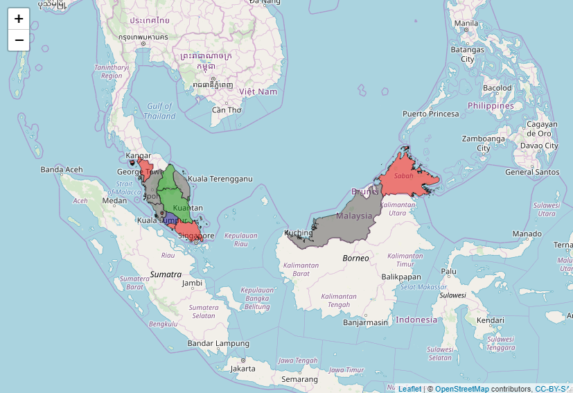

# GE14-Prediction

Data Visualization for pooling before Malaysia's General Election 14 (GE14)  

## Introduction
GE14 is the turning point in Malaysia politics, which the Pakatan Harapan (PH) take the central control of Malaysia. In this practice, I'm analyzing the data collected from CeTMA UUM, which filled by respondents from each state of Malaysia. This data is about the pre-election survey.

## Main Objective:
1. To predict the GE14's result from pre-election survey
2. To determine whether religious issues need to be prioritized.
3. To determine the satisfaction on Dato' Sri Najib's leadership among the Barisan Nasional's (BN) supporters.

## 1. GE14's Prediction

This Malaysia map is produced using leaflet. It shows the pooling for pre-election before GE14. From this map, we can say the PH may win in GE14, because most of the states voting PH despite those "not sure" answers.

## 2. Priority of Religious Issue

This bar chart shows the agreement of the priority for religious issue that voted by different religions. From this bar chart, we can know that most of the religion, which is Buddism, Hinduism and Christian do not agree that religious issue should be prioritized, instead they urge to prioritize the economy and development of Malaysia. Besides, Muslim and Sikhism wanted religious issue to be prioritized. However, Toaism, confucianism and other religious having indifferent opinion in this matter.

## 3. Satisfaction on Dato' Sri Najib's leadership

This pie chart shows the level of satisfaction on Dato' Sri Najib's leadership among the BN supporters. In order to shortlist those supported BN in previous General Elections, I filtered all respondents those who agree on Dasar Transformasi Nasional. As the result, most of the BN supporters satisfied Dato' Sri Najib Performance. However, the fact that many supporters have a little disappointment on Dato's Sri Najib also should be highlighted.
